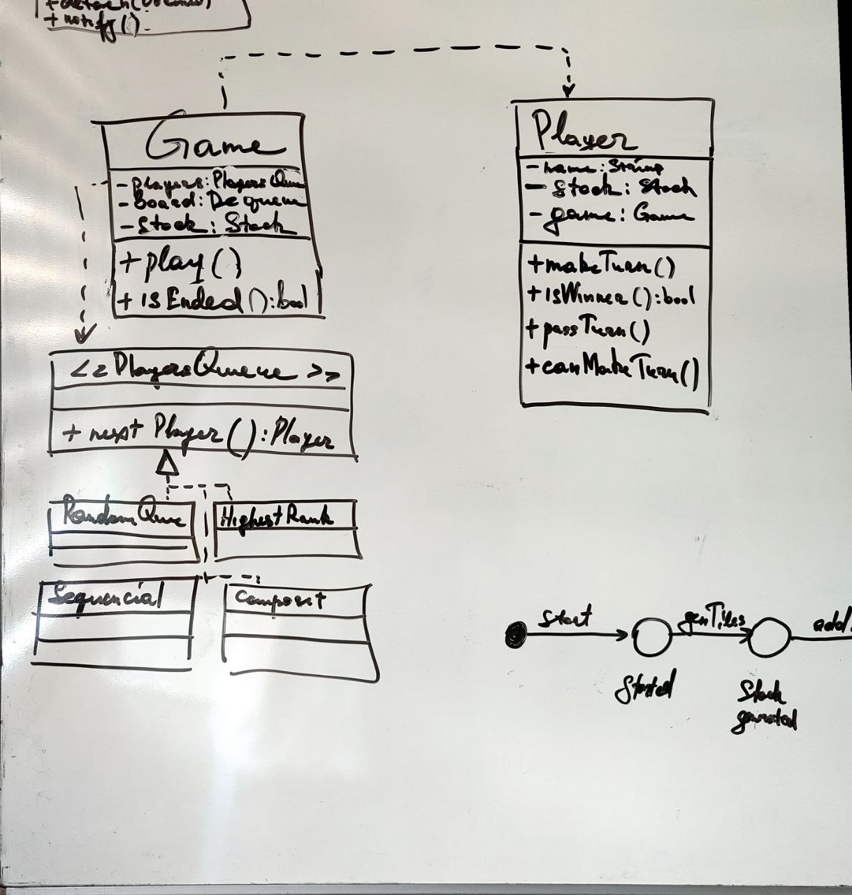
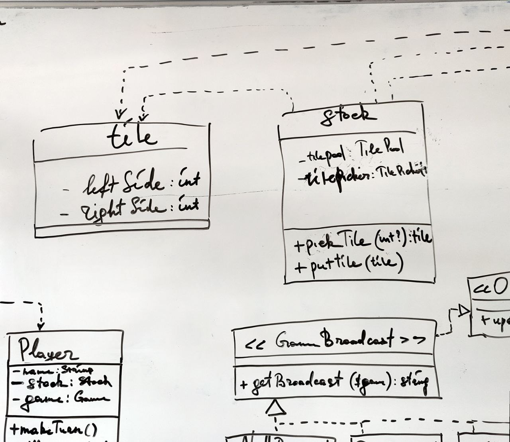
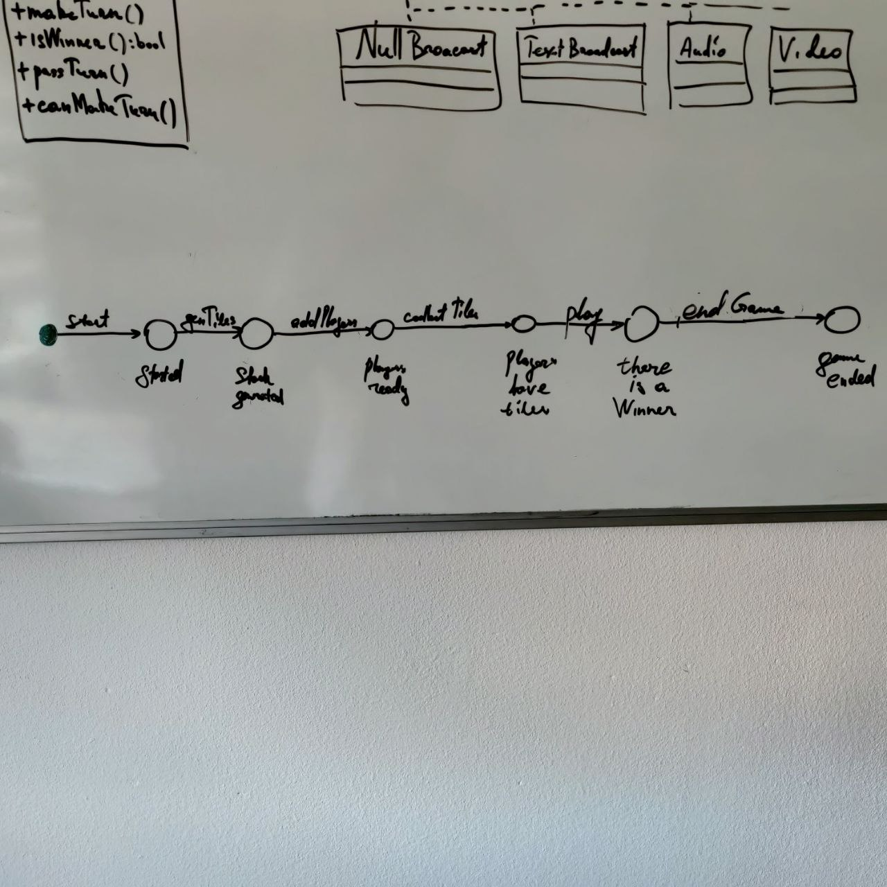
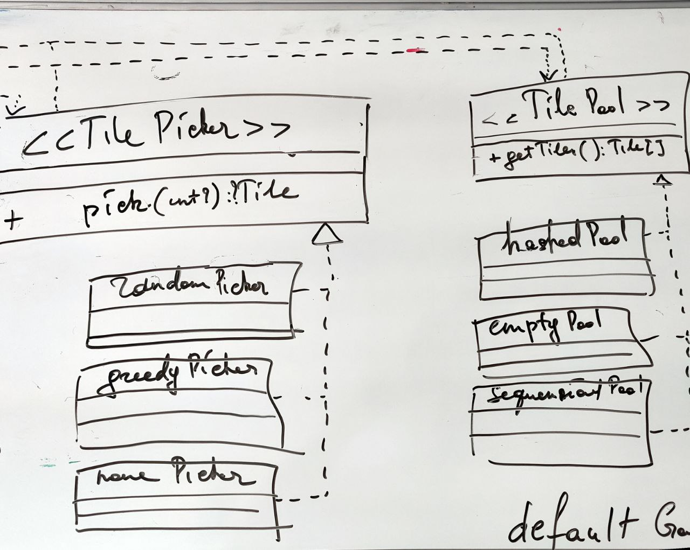

# Dominos Game

Dominoes is a family of games played with rectangular tiles. Each tile is divided into two square ends. Each end is marked with a number (one to
six) of spots or is blank. There are 28 tiles, one for each combination of spots and blanks (see image).
Write a program which allows two players to play Dominoes against each other:
 - The 28 tiles are shuffled face down and form the stock. Each player draws seven tiles.
 - Pick a random tile to start the line of play.
 - The players alternately extend the line of play with one tile at one of its two ends;
 - A tile may only be placed next to another tile, if their respective values on the
connecting ends are identical.
 - If a player is unable to place a valid tile, they must keep on pulling tiles from the stock
until they can.
 - The game ends when one player wins by playing their last tile.
 - You're not supposed to create an interactive application. Just write a program that will
follow the rules above.

## Implementation:

There are N entities:
 - A Game. Entity can say what the game status is now and who plays it and in what order. Game can be started with method `play`
 - A Player. Player of the game has her own stock of tiles which she can use to play a game
 - A Tile. This is simply a 2 side tile consisting of 2 integer numbers
 - A Stock. A stock of tiles consist of tiles. It is possible to add and pick tiles from stock. The pick and remove logic is configurable
 
### UML

 
 
 
 
